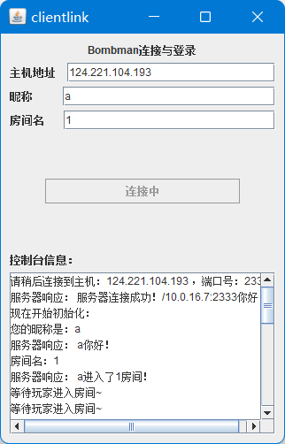

# BombMan——实时联机对战小游戏

by 雾切凉宫 KirigiriSuzumiya 2022/6/1


[TOC]


## 1 需求分析

使用TCP协议传输socket数据包、利用swing gui界面编写一个简单的实时联机对战小游戏。希望整个软件可以尽量轻量化，使用最简单的包体实现基础的联机交互功能，轻量化体验好友间的简单娱乐方式。

玩家对游戏的生理需求，就像硬件之于计算机一样，没有高精尖的硬件许多功能将无法实现，游戏亦是如此。游戏的视觉、听觉、触觉反馈决定了不同的用户群体，轻度休闲游戏Q版可爱、明亮的颜色取用，音效、音乐较为轻松愉悦，较少的震动反馈。卡牌、策略经营类等中度游戏，画面风格会因游戏不同而有较大差异，在配音方面着重下功夫，在特定时候给予较强震感反馈。RPG等重度游戏而言，游戏色彩不会过于突兀，采用现实的画面设计，针对不同场景音效会有多种变化，打击感等反馈最为丰富。一款好的游戏需要在视觉、听觉、触觉交互相结合，需要从多方面收集试玩人员、用户意见，不断进行迭代优化。

本文旨在通过简单的java自带包体实现一个服务端与客户端分离的能够实现远程实时联机的对战小游戏。重点在实时联机的过程实现，而不是玩法与画面的优化。


## 2 程序设计

### 2.1 总体设计

由于是联机游戏，代码包主要分为服务端与客户端两部分。

最后将其打包为两个jar，分别为gameserver.jar（服务端）与bombman.jar（客户端）

服务端实现功能：为每一个连接的请求分配一个进程以完成实时数据交换与更新

客户端实现功能：与服务端进行通信，实时获取状态信息并上传客户机的键盘操作


### 2.2 服务端设计

#### 2.2.1 主入口 TCPserver.java

​     作为服务端jar的main类，实现了为每一个连接请求分配一个更新进程的功能。同时也记录每一位登录玩家的基础信息，方便后续的匹配机制与对战功能的实现。使用socket和thread进程具体实现了等待远程连接、为每一个连接创立一个service进程、创立监听端口的功能。

```java
package bombman;
import java.io.DataInputStream;
import java.io.DataOutputStream;
import java.io.IOException;
import java.net.ServerSocket;
import java.net.Socket;
import java.net.SocketTimeoutException;
public class TCPserver extends Thread{
    ServerSocket self_socket;
    TCPserver(int port) throws IOException {
        self_socket = new ServerSocket(port);
        self_socket.setSoTimeout(0);
    }
    public void run()
    {
        while(true)
        {
            try
            {
                //等待远程连接
                System.out.println("等待远程连接，端口号为：" + self_socket.getLocalPort() + "...");
                Socket server = self_socket.accept();
                //为每一个连接创立一个service进程
                service service1 =new service(server);
                Thread t1=new Thread(service1);
                t1.start();
            }catch(SocketTimeoutException s)
            {
                System.out.println("Socket timed out!");
            }catch(IOException e)
            {
                e.printStackTrace();
            }
        }
    }
    public static void main(String [] args)
    {
        try
        {
            //创立监听端口
            Thread t = new TCPserver(2333);
            t.run();
        }catch(IOException e)
        {
            e.printStackTrace();
        }
    }
}
```


#### 2.2.2 交互主进程service.java

由TCPserver调起的进程。实现用户连接后的绝大多数交互与数据同步功能。继承了runnable接口，作为可多开的独立线程在服务端上运行。利用java.net包具体实现了初始化地图信息、初始化输入输出流、与客户端进行初步的信息核验、创建玩家对象、匹配玩家成组、向客户端传递地图信息、等待玩家准备、向客户端传递地图信息、循环实现实时信息更新与同步、接受来自客户端的键盘输入信息等主要核心功能，是整个服务端的实现内核。

```
package bombman;
import java.net.*;
import java.io.*;
import java.util.Objects;
import static java.lang.Thread.sleep;

public class service implements Runnable {
    Socket server;
    static User[] allplayer=new User[100];
    static int player_count=0;
    public service (Socket server1){
        server=server1;
    }
    //初始化地图信息
    int[][] map1=  new int[][]{
            {1,0,1,1,1,0,1,0,1,1},
            {1,1,1,0,1,0,1,1,1,1},
            {0,1,1,0,0,0,0,0,0,0},
            {1,0,0,0,0,0,0,0,1,1},
            {-1,-1,-1,0,0,0,0,0,1,1},
            {0,0,-1,0,0,0,-1,-1,-1,0},
            {1,0,-1,0,-1,0,-1,1,-1,-1},
            {0,0,0,0,-1,-1,-1,0,0,1},
            {1,1,0,0,0,0,0,0,0,0},
            {0,0,0,0,0,0,0,0,0,0}
    };
    public void run() {
        try {
        	//初始化输入输出流
            DataInputStream in = new DataInputStream(server.getInputStream());
            System.out.println(in.readUTF());
            DataOutputStream out = null;
            out = new DataOutputStream(server.getOutputStream());
			//与客户端进行初步的信息交换
            out.writeUTF("服务器连接成功！" + server.getLocalSocketAddress() + "你好！");
            String name = in.readUTF();
            out.writeUTF(name + "你好！");
            String RoomNum = in.readUTF();
            out.writeUTF(name + "进入了" + RoomNum + "房间！");
            System.out.println(name + '-' + server.getRemoteSocketAddress() + "进入了" + RoomNum + "房间");
            //创建玩家对象并编入类数组，最后匹配玩家
            User player = new User(name,RoomNum,out);
            for (int i=1;i<=player_count;i++)
            {
                if (RoomNum.equals(allplayer[i].room) && allplayer[i].enemy==null)
                {
                    allplayer[i].enemy=player;
                    player.enemy=allplayer[i];
                    player.seat=2;
                    player.enemy.seat=1;
                }

            }
            player_count++;
            allplayer[player_count]= player;
            //若未能匹配成功则等待玩家
            while (player.enemy==null)
            {
                sleep(1000);
                out.writeUTF("等待玩家进入房间~");
            }
            out.writeUTF("你的对手是"+player.enemy.name+"!开始互啄把！");
            System.out.println(RoomNum+"房间："+player.name+" 与 "+player.enemy.name+"成功配对！");

            out.writeUTF(player.name+" V.S "+player.enemy.name); //提供窗口名
            //向客户端传递地图信息
            for (int i=0;i<10;i++)
            {
                for(int j=0;j<10;j++)
                {
                    out.writeInt(map1[i][j]);
                }
            }
            String receive_msg=in.readUTF();//等待玩家准备
            System.out.println(player.name+"已准备");
            //初始化玩家位置
            if (player.seat==1)
            {
                player.x=5;
                player.y=1;
            }
            else
            {
                player.x=5;
                player.y=10;
            }
            //循环实现实时信息更新与同步
            while (true)
            {
                receive_msg=in.readUTF();
				//信息同步功能
                if (receive_msg.equals("getinfo"))
                {
                    if (player.mp>=100){player.hp=player.hp+20;player.mp=0;}
                    if (player.hp>=100)player.hp=100;
                    if (player.seat==1)
                    {
                        out.writeInt(player.x);
                        out.writeInt(player.y);
                        out.writeInt(player.enemy.x);
                        out.writeInt(player.enemy.y);
                        out.writeInt(player.hp);
                        out.writeInt(player.mp);
                    }
                    else
                    {
                        out.writeInt(player.enemy.x);
                        out.writeInt(player.enemy.y);
                        out.writeInt(player.x);
                        out.writeInt(player.y);
                        out.writeInt(player.hp);
                        out.writeInt(player.mp);
                    }
                }
                //接受来自客户端的键盘输入信息
                else
                {
                    System.out.println("客户端发送："+receive_msg);
                    if (receive_msg.equals("w"))
                    {
                        if (player.y-1>0 && map1[player.y-1][player.x]==map1[player.y-2][player.x])
                            player.y=player.y-1;
                    }
                    else if (receive_msg.equals("a"))
                    {
                        if (player.x-1>=0 && map1[player.y-1][player.x]==map1[player.y-1][player.x-1])
                            player.x=player.x-1;
                    }
                    else if (receive_msg.equals("s"))
                    {
                        if (player.y+1<=10 && map1[player.y-1][player.x]==map1[player.y][player.x])
                            player.y=player.y+1;
                    }
                    else if (receive_msg.equals("d"))
                    {
                        if (player.x+1<10 && map1[player.y-1][player.x]==map1[player.y-1][player.x+1])
                        player.x=player.x+1;
                    }
                    else if (receive_msg.equals("up") || receive_msg.equals("down") || receive_msg.equals("left") || receive_msg.equals("right"))
                    {
                        Thread t=new Thread(new bomb(receive_msg,player.x,player.y,out,player.enemy));
                        t.start();
                    }
                }

            }

        } catch (IOException e) {
            e.printStackTrace();
        } catch (InterruptedException e) {
            e.printStackTrace();
        }
    }
}
```


#### 2.2.3 延时响应进程 bomb.java

由service调起的子进程，实现客户端输入命令到后台数据延时转换的功能。利用sleep函数在分离的进程中实现延时生效的效果，避免使主进程被子任务锁死的危险。具体实现了输入输出流初始化、客户端命令到数据转换与数据包传送的功能。

```java
package bombman;

import java.io.DataOutputStream;
import java.io.IOException;

import static java.lang.Math.abs;
import static java.lang.Thread.sleep;

public class bomb implements Runnable{
    String msg;
    int x,y;
    DataOutputStream out;
    User enemy;
    //输入输出流初始化
    bomb(String msg,int x,int y ,DataOutputStream out,User enemy)
    {
        this.msg=msg;
        this.x=x;
        this.y=y;
        this.out=out;
        this.enemy=enemy;
    }
    @Override
    public void run() {
    	//客户端命令到数据转换
        if (msg.equals("up"))
        {
            y=y-2;
        }
        else if (msg.equals("down"))
        {
            y=y+2;
        }
        else if (msg.equals("left"))
        {
            x=x-2;
        }
        else if (msg.equals("right"))
        {
            x=x+2;
        }
        try {
            sleep(1500);
        } catch (InterruptedException e) {
            e.printStackTrace();
        }
        if (enemy.x==x && enemy.y==y)
        {
            enemy.hp=enemy.hp-20;
            enemy.enemy.mp=enemy.enemy.mp+20;
        }
        else if (abs(enemy.x-x)<=1 && abs(enemy.y-y)<=1)
        {
            enemy.hp=enemy.hp-10;
            enemy.enemy.mp=enemy.enemy.mp+20;
        }
        if (enemy.enemy.x==x && enemy.enemy.y==y)
        {
            enemy.enemy.hp=enemy.enemy.hp-10;
            enemy.enemy.mp=enemy.enemy.mp+20;
        }
        else if (abs(enemy.enemy.x-x)<=1 && abs(enemy.enemy.y-y)<=1)
        {
            enemy.enemy.hp=enemy.enemy.hp-5;
            enemy.enemy.mp=enemy.enemy.mp+10;
        }
        try {
        	//数据包传送
            out.writeInt(x*100+y+10000);
            enemy.out.writeInt(x*100+y+10000);
        } catch (IOException e) {
            e.printStackTrace();
        }
    }
}
```


#### 2.2.4 玩家信息类 User.java

```
package bombman;

import java.io.DataOutputStream;

public class User {
    public String name;
    public String room;
    public User enemy;
    public int x,y,seat;
    DataOutputStream out;
    int hp,mp;
    User(String name1,String room1,DataOutputStream out){
        name=name1;
        room=room1;
        hp=100;
        mp=0;
        this.out=out;
    }
    public void attack(int damage)
    {
        enemy.hp= enemy.hp-damage;
    }
}
```


### 2.3 客户端设计

#### 2.3.1 客户端主入口 clientlink.java

 作为客户端jar的main类，使用swing包创立一个gui界面以收集用户信息与展示连接状态，创建一个按钮监听，并在接受到点击后创建一个TCPclient进程以创建连接与实现信息交互。

```java
package bombman;

import javax.swing.*;
import java.awt.event.ActionEvent;
import java.awt.event.ActionListener;


public class clientlink {
    private JTextField roomname;
    private JTextField address;
    private JButton linkButton;
    private JTextField name;
    private JPanel mainPanel;
    public JTextArea info;

    static JFrame frame;
    public clientlink() {
        info.setText("请稍后");
        //创建一个按钮的监听
        linkButton.addActionListener(new ActionListener() {
            @Override
            public void actionPerformed(ActionEvent e) {
                linkButton.setEnabled(false);
                linkButton.setText("连接中");
                String serverName = address.getText();
                String player_name = name.getText();
                String room_name = roomname.getText();
                Thread t = new Thread(new TCPclient(serverName,player_name,room_name,info));
                t.start();
            }
        });
    }

    public static void  main(String[] args) {
        frame = new JFrame("clientlink");
        frame.setContentPane(new clientlink().mainPanel);
        frame.setDefaultCloseOperation(JFrame.EXIT_ON_CLOSE);
        frame.pack();
        frame.setVisible(true);
    }

}
```

gui界面展示：


#### 2.3.2 客户端交互主进程 TCPclient.java

由clientlink调起的子进程，实现客户端与服务端的通信并与服务端初步核实信息，并完成或等待玩家匹配。

```java
package bombman;

import javax.swing.*;
import java.io.*;
import java.net.Socket;
import java.util.Scanner;

import static java.lang.Thread.sleep;


public class TCPclient implements Runnable{
    String serverName;
    String player_name;
    String room_name;
    JTextArea info;
	//初始化类对象
    public TCPclient(String serverName, String player_name, String room_name, JTextArea info)
    {
        this.serverName=serverName;
        this.player_name=player_name;
        this.room_name=room_name;
        this.info=info;
    }

    @Override
    public  void run() {
        int port=2333;
        String server_mes;
        try
        {
            //与服务端初步数据核对
            info.append("连接到主机：" + serverName + " ，端口号：" + port+"\n");
            Socket client = new Socket(serverName, port);
            OutputStream outToServer = client.getOutputStream();
            DataOutputStream out = new DataOutputStream(outToServer);
            out.writeUTF("来自：" + client.getLocalSocketAddress()+"的连接");
            InputStream inFromServer = client.getInputStream();
            DataInputStream in = new DataInputStream(inFromServer);
            info.append("服务器响应： " + in.readUTF()+"\n");
            info.append("现在开始初始化：\n");
            info.append("您的昵称是："+player_name+"\n");
            out.writeUTF(player_name);
            info.append("服务器响应： " + in.readUTF()+"\n");
            info.append("房间名："+room_name+"\n");
            out.writeUTF(room_name);
            info.append("服务器响应： " + in.readUTF()+"\n");
            //进行玩家匹配
            while ((server_mes=in.readUTF()).equals("等待玩家进入房间~")){
                info.append(server_mes+"\n");
            }
            info.append("服务器响应： " + server_mes);
            clientgui gui = new clientgui(out,in);
            gui.run();

        }catch(IOException ex)
        {
            ex.printStackTrace();
        }
    }
}
```

#### 2.3.3 客户端图形主界面 clientgui.java

由TCPclient调起的子进程，实现了游戏界面的gui显示与各类键盘与按键点击的监控，同时实时刷新状态以实现实时对战的可视化。并具体实现了监听准备按钮、读取地图、启动实时数据更新、添加键盘监听、启动gui界面等功能。

```java
package bombman;

import javax.swing.*;
import java.awt.event.*;
import java.io.DataInputStream;
import java.io.DataOutputStream;
import java.io.IOException;

public class clientgui {
    DataOutputStream out;
    DataInputStream in;
    public JPanel panel1;
    public JProgressBar progressBar1;
    public JProgressBar progressBar2;
    public JPanel fightwindow;
    public JProgressBar progressBar3;
    public JLabel maplabel;
    public JButton cancel;
    public JButton prepare;
    public JTextArea info;
    private JLabel controll_info;
    private JPanel loc_man;
    private JPanel loc_man2;
    private JPanel explode;
    private JLabel pic;
    int[][] map=new int[10][10];
    Thread t;

    public clientgui(DataOutputStream out1, DataInputStream in1) throws IOException {

        this.out=out1;
        this.in=in1;
        info.setText("请稍后！");
        //监听准备按钮
        prepare.addActionListener(new ActionListener() {
            @Override
            public void actionPerformed(ActionEvent e) {
                try {
                    if (prepare.getText().equals("准备"))
                    {
                    	//读取地图
                        System.out.println("地图数据读取中……");
                        info.setText(info.getText()+"\n地图数据读取中……");
                        for(int i=0;i<10;i++){
                            for (int j=0;j<10;j++){
                                map[i][j]=in.readInt();
                            }
                        }
                        System.out.println("地图数据读取完成！");
                        info.setText(info.getText()+"\n地图数据读取完成！");
                        out.writeUTF("ready!");
                        info.setText(info.getText()+"\n准备完成！");
                        info.setText(info.getText()+"\n--------------------\n");
                        info.setText(info.getText()+"\n游戏指南：\nWASD移动\n上下左右键投掷炸弹\n炸弹命中敌我都会扣血与加能量\n能量满了能加血");
                        info.setText(info.getText()+"\n--------------------\n");
                        prepare.setText("开始");
                        controll_info.setText("阅读指南");
                    }
                    else{
                    	//启动实时数据更新
                        info.setText(info.getText()+"开始游戏！");
                        controll_info.setText("开始战斗！");
                        prepare.setEnabled(false);
                        panel1.requestFocus();
                        explode.setLayout(null);
                        explode.setOpaque(false);
                        explode.setLocation(180,180);
                        info_refresh refresh=new info_refresh(progressBar1,progressBar2,info,out,in,maplabel,loc_man,loc_man2,explode,controll_info);
                        t=new Thread(refresh);
                        t.start();

                    }

                } catch (IOException ex) {
                    ex.printStackTrace();
                }
            }
        });
        //添加键盘监听
        panel1.addKeyListener(new KeyAdapter() {
            @Override
            public void keyPressed(KeyEvent e) {
                panel1.requestFocus();
                //if (prepare.isEnabled())return;
                String keyin="";
                switch (e.getKeyCode()){
                    case 38 : keyin="up";break;
                    case 37 : keyin="left";break;
                    case 40 : keyin="down";break;
                    case 39 : keyin="right";break;
                    case 87 : keyin="w";break;
                    case 65 : keyin="a";break;
                    case 83 : keyin="s";break;
                    case 68 : keyin="d";break;
                    default : keyin="";
                }
                try {
                    out.writeUTF(keyin);
                } catch (IOException ex) {
                    ex.printStackTrace();
                }
                //controll_info.setText(keyin);
            }
        });
        //添加焦点获取监听
        panel1.addFocusListener(new FocusAdapter() {
        });
        cancel.addActionListener(new ActionListener() {
            @Override
            public void actionPerformed(ActionEvent e) {
                panel1.requestFocus();
            }
        });
    }

    public void run() throws IOException {
    	//启动gui界面
        String server_mes;
        server_mes=in.readUTF();
        JFrame frame = new JFrame(server_mes);
        frame.setContentPane(new clientgui(out,in).panel1);
        frame.setDefaultCloseOperation(JFrame.EXIT_ON_CLOSE);
        frame.pack();
        frame.setVisible(true);
    }
}
```


#### 2.3.4 数据同步进程 info_refresh.java

由TCPclient调起的子进程，实现了客户端到服务端的实时数据交换与gui界面更新。具体实现了对象初始化、炸弹位置解析与gui更新、实时玩家位置及其gui更新等功能。

```
package bombman;


import javax.swing.*;
import java.awt.*;
import java.io.DataInputStream;
import java.io.DataOutputStream;
import java.io.IOException;

import static java.lang.Thread.sleep;

public class info_refresh implements Runnable{
    JProgressBar progressBar1;
    JProgressBar progressBar2;
    JTextArea info;
    JPanel loc_man;
    JLabel maplabel;
    DataOutputStream out;
    DataInputStream in;
    JPanel loc_man2;
    JPanel explode;
    JLabel controll_info;
    int hp,mp,x,y,x1,y1,ex_y,ex_x;
    //对象初始化
    info_refresh(JProgressBar progressBar1, JProgressBar progressBar2, JTextArea info ,DataOutputStream out, DataInputStream in,JLabel maplabel,JPanel loc_man, JPanel loc_man2,JPanel explode,JLabel controll_info) throws IOException {
        this.info=info;
        this.progressBar1=progressBar1;
        this.progressBar2=progressBar2;
        this.maplabel=maplabel;
        this.in=in;
        this.out=out;
        this.loc_man=loc_man;
        this.loc_man2=loc_man2;
        this.explode=explode;
        this.controll_info=controll_info;
    }


    @Override
    public void run() {
        explode.setOpaque(false);
        while(true) {
            try {
            	//炸弹位置解析与gui更新
                out.writeUTF("getinfo");
                for (int i=0;i<6;i++)
                {
                    int re_info=in.readInt();
                    if (re_info>=10000)
                    {
                        ex_y=re_info % 100;
                        ex_x=re_info/100 % 100;
                        i=i-1;
                        explode.setOpaque(true);
                        Thread t=new Thread(new explo_display(explode,ex_x-1,ex_y-1));
                        t.start();
                    }
                    else
                    {
                    //实时玩家位置更新
                        switch (i){
                            case 0 : x = re_info;break;
                            case 1 : y = re_info;break;
                            case 2 : x1 = re_info;break;
                            case 3 : y1 = re_info;break;
                            case 4 : hp = re_info;break;
                            case 5 : mp = re_info;break;
                        }
                    }
                }
				//gui更新
                progressBar1.setValue(hp);
                progressBar2.setValue(mp);
                loc_man.setLocation(60 * x, 60 * y + 5);
                loc_man2.setLayout(null);
                loc_man2.setLocation(60 * x1, 60 * y1 + 5);
                explode.setLayout(null);
                explode.setLocation(60*(ex_x-1),60*(ex_y-2));

                sleep(300);
                if (hp <= 0) {
                    info.append("你被打败了！");
                    controll_info.setText("你被打败了");
                    return;
                }
            } catch (IOException e) {
                try {
                    System.out.println(in.readUTF());
                } catch (IOException ex) {
                    ex.printStackTrace();
                }
            } catch (InterruptedException e) {
                e.printStackTrace();
            }
        }
    }
}
```


## 3 运行测试

### 3.1 服务端运行测试

我这里使用了真实的**linux云服务器**环境进行测试，后台保持运行，在您看到这篇文档时应该也可以实际连接并使用。

云服务器java安装与配置不再赘述，这里直接展示测试结果，服务端并不需要太多人为的交互直接命令行运行即可。

后续的客户端

```
运行命令：java -jar gameserver.jar
```

服务端没有gui界面，只有简单的交互日志可供查阅与排错。


### 3.2 客户端运行测试

#### 3.2.1 连接与登录界面

一个简单的信息采集窗口，主机地址默认填写我云服务器的地址，昵称与房间名可以自取。点击连接后会开始等待其他玩家进入房间。下方的控制台信息会实时更新与服务端的交互状态。



#### 3.2.2 实时对战界面

分为4块主要功能区：

- 左上部分为地图与战斗显示区
- 右上部分为玩家状态信息栏区
- 左下为控制台与提示区
- 右下为部分按钮交互区


简单直观的界面展示测试。